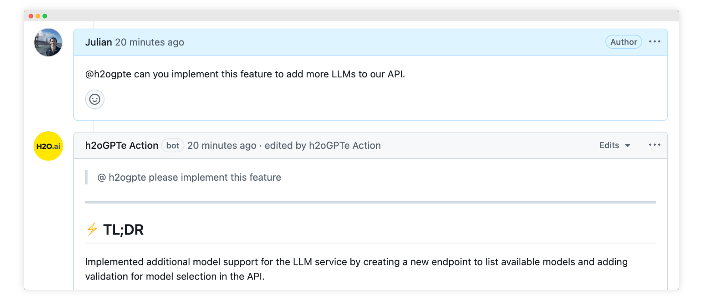

# h2oGPTe Action



The h2oGPTe GitHub Action brings intelligent AI assistance directly into your GitHub workflow. Simply tag `@h2ogpte` in any comment, issue, or pull request, and the agent will provide instant AI-powered code review feedback, understand your codebase context, and even write code and make commits when requested.

## 🚀 Quick Start

Install the action in your repository using our installation script:

```bash
curl -fsSL https://raw.githubusercontent.com/h2oai/h2ogpte-action/refs/heads/main/installation.sh | sh -s < /dev/tty
```

After installation, you'll need to configure two repository secrets:

1. **API Key**: Get your API key from [h2oGPTe API](https://h2ogpte.genai.h2o.ai/api) and add it as a repository secret named `H2OGPTE_API_KEY`
2. **API Base URL**: Add your h2oGPTe server's base URL as a repository secret named `H2OGPTE_API_BASE` (e.g., `https://h2ogpte.genai.h2o.ai`)

> **Note**: If you're using the default h2oGPTe cloud instance, the API base URL is `https://h2ogpte.genai.h2o.ai`. For self-hosted instances, use your server's URL.

## 💬 Basic Usage

Once installed, simply mention `@h2ogpte` in any comment, issue, or pull request:

```text
@h2ogpte Can you review the changes in this PR and suggest improvements?
```

The agent will automatically analyze your code and provide intelligent feedback.

## ⚙️ Inputs

| Input             | Description                                                                           | Required | Default Value                            |
| ----------------- | ------------------------------------------------------------------------------------- | -------- | ---------------------------------------- |
| github_token      | Github access token.                                                                  | Yes      | Assigned automatically by GitHub Actions |
| h2ogpte_api_key   | h2oGPTe API Key from your h2oGPTe instance (e.g., <https://h2ogpte.genai.h2o.ai/api>) | Yes      | –                                        |
| h2ogpte_api_base  | h2oGPTe API base url address (no trailing slash)                                      | No       | <https://h2ogpte.genai.h2o.ai>           |
| github_api_url    | GitHub API base url (no trailing slash)                                               | No       | <https://api.github.com>                 |
| github_server_url | GitHub server base url (no trailing slash)                                            | No       | <https://github.com>                     |

## 📚 Examples

The repository includes several example workflows:

- **[Basic Usage](examples/h2ogpte.yaml)** - Standard workflow for manual `@h2ogpte` mentions
- **[Auto PR Review](examples/h2ogpte_auto_pr.yaml)** - Automatic code review on pull requests
- **[Auto Documentation](examples/h2ogpte_auto_docs.yaml)** - Automatic documentation generation

See [examples](examples/) for more workflow configurations.

## 📖 Documentation

- **[Configuration](docs/CONFIGURATION.md)** - Detailed configuration options and settings
- **[Usage Guide](docs/USAGE.md)** - Comprehensive usage examples and custom prompting
- **[Contributing](CONTRIBUTING.md)** - Development setup and contribution guidelines

## ✅ Requirements

- h2oGPTe version >= 1.6.31

## 📄 License

This project is licensed under the Apache License 2.0 - see the [LICENSE](LICENSE) file for details.

## 🆘 Support

For questions, bug reports, or feature requests, please open an issue on GitHub.
